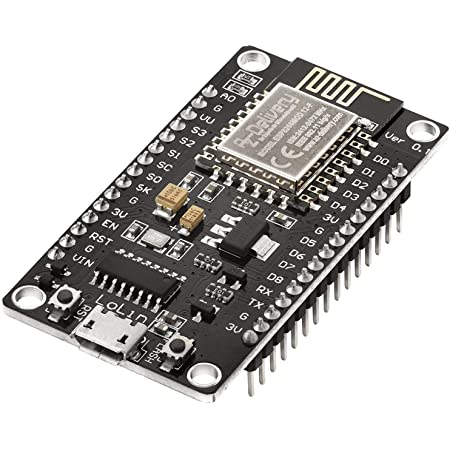

# weather-ESP

Um ein ESP Board dazu zu bringen über MQTT im Homesens Netzwerk zu kommunizieren. Damit ich da nicht Raspberry Pis dazu brauche. Dafür sind Microcontroller besser geeignet.

Schritt 1: Wetterdaten über Microcontroller, nicht über Raspi. Gilt für Indoor und Outdoor.

Schritt 2: Stromdaten über Microcontroller.


# NodeMCU

- Großes Board V3, 

- ESP8266, 

- CH340G USB-Serial

  

  

# Software

- Arduino (Pro) IDE 2.0
- ESP Boards in Board Manager ([Tutorial](https://randomnerdtutorials.com/installing-esp8266-nodemcu-arduino-ide-2-0/))
- Braucht keine extra Treiber für USB-Serial @ M1 Macbook. Blinky läuft super.


# Projektspezfisch

- PubSubClient Library von Nick O'Leary ([Link](https://pubsubclient.knolleary.net)), in dem Library Manager von Arduino
- Adafruit BME280 Library

# WeatherMCU

NodeMCU basierend auf ESP8266, der mit Bosch BME280 Temperatur, Luftfeuchte und Luftdruck misst und per MQTT an den Broker am NAS schickt.

## Features

- [x] **Status LED**
  Während Connection leuchtet Builtin LED. Wenn Connection steht, dann geht die LED aus. Dienst zur Fehlerbehebung wenn die LED ständig leuchtet, ist was falsch.
  LED ist LOW Active im Code @ NodeMCU!
  LED ist an während gesendet wird. Blinkt also pro Message kurz auf.

- [x] **IP/MAC Publish**
  Zusätzlich zu den spezifischen Daten werden auch IP und MAC Adresse übertragen. Dient zu Debug.
- [x] **Cooles Case**

## ToDo

- 

## Log

Tutorial befolgen ([Link](https://smarthome-blogger.de/blog/esp8266-projekte/esp8266-mqtt-tutorial)) hat auch recv!

Code funzt Out of the Box. 

Mit [MQTTExplorer](http://mqtt-explorer.com) getestet. Mosquitto läuft am NAS.

IP zu Char[] in C -> [Link](https://arduino.stackexchange.com/questions/57262/how-to-copy-ipaddress-class-into-character-buffer-getting-error-inet-ntop-wa)

```c
char bufIp [50];
IPAddress ipaddr = WiFi.localIP();
sprintf(bufIp, "%d.%d.%d.%d", ipaddr[0], ipaddr[1], ipaddr[2], ipaddr[3]);
client.publish("NodeMCU/ip", bufIp);
```

Mac zu Char [] in C

```c
String mac = String(WiFi.macAddress());
char bufMac [20];
mac.toCharArray(bufMac, 20);
client.publish("NodeMCU/mac", bufMac);
```

Weather Data -> [Link](https://randomnerdtutorials.com/esp8266-bme280-arduino-ide/)

Pinout: 


| I2C Device | NodeMCU | ESP8266 |      |
| ---------- | ------- | ------- | ---- |
| VIN        | 3.3V    | 3.3V    |      |
| GND        | GND     | GND     |      |
| SCL        | D1      | GPIO 5  |      |
| SDA        | D2      | GPIO 4  |      |


Wie viel strom verbraucht der? 1 Stunde messen auf USB ->  2 mAh, das stimmt doch net oder? XD

Wenn kein BME280 da ist, dann schreibt der das als homesens/wohnzimmer/message raus.

Case Kleiner Machen, dass USB Port mehr raus steht. 

Case Tiefer machen, damit NodeMCU mit Header Pis auch rein passt
